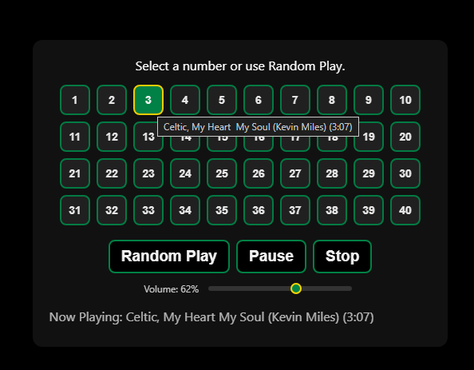
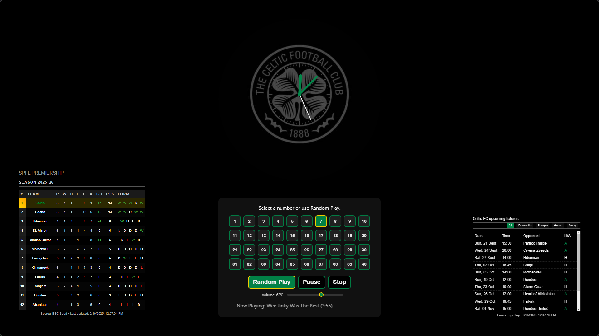

# MMM-JukeBox

A MagicMirror² module that displays a grid of numbered buttons for your audio tracks and lets you play them individually or in a randomized loop. 
Supports local files stored on the SD card, USB paths (securely streamed via the backend), and URL sources. 
Includes pagination, hover/active styling, and an optional autostart random loop.
Number of buttons on the grid will automatically match the number of sound files 

- **Author**: gitgitaway
- **MagicMirror² Compatibility**: Tested with current MM² versions
- **Files**: `MMM-JukeBox.js`, `node_helper.js`, `MMM-JukeBox.css`

---
## Screenshots
 
- 

- 


## Features
- **Auto-scan** of audio files from a local `soundFiles` folder or a configured USB folder
- **Random Play** with continuous looping
- **Shuffle control bar icon** that matches the existing symbol formatting
- **Buttons inactive until clicked** when `autostartRandomLoop: false`
- **Pagination** to handle large libraries (configurable page size)
- **USB file streaming** via an Express route to avoid `file:///` browser restrictions
- **Autostart Random Loop** on startup (optional)
- **Continue playing on HIDE** (optional)
- **Allowed extensions filter** (front-end configurable and enforced in the backend)

---

## Installation
1. Navigate to your MagicMirror modules folder:
   ```bash
   cd ~/MagicMirror/modules
   ```
2. Clone or copy this module into `MMM-JukeBox/`.

   ```bash
   git clone https://github.com/gitgitaway/MMM-JukeBox`.
   ```
3. Install dependencies
```bash
npm install
```
4. Place your audio files in:
   - Local mode (default): `MMM-JukeBox/soundFiles/`
   - USB mode: your USB directory (e.g., `D:/soundFiles`) and set `source: "USB"` in config

5. Add the config to ~/MagicMirror/config/config.js`

6. Restart MagicMirror.

---

## Configuration
Add the module to your `config/config.js`:

```javascript
/* Explanation:
 * Example config for MMM-JukeBox showing common options and inline comments.
 * - source: set to "file" (default), "USB", or "URL" depending on where your media lives.
 * - usbPath: required if source is "USB". Use your OS path (e.g., D:/soundFiles on Windows).
 * - allowedExtensions: filter for scan (front and back end align on the same list).
 * - pageSize: how many numbered buttons per page.
 * - autostartRandomLoop: start random playback automatically after tracks are scanned.
 * - continueOnHide: keep audio playing when the module is hidden.
 * - showControlBar: set true to use symbol bar (🔀 ◀ ⏸ ▷ ✖ ▶). When true, the legacy Random button is hidden.
 */
{
  module: "MMM-JukeBox",
  position: "top_left", // Explanation: choose any MagicMirror position
  config: {
    source: "file",                 // "file" | "USB" | "URL"
    usbPath: "D:/soundFiles",       // Explanation: only used when source === "USB"
    allowedExtensions: [".mp3", ".wav", ".ogg", ".m4a"],
    pageSize: 40,                    // Explanation: number of buttons per page
    showControlBar: true,            // NEW: use symbol bar; hides legacy Random button
    randomButtonText: "Random Play", // Explanation: label for the legacy random button (when control bar is off)
    stopButtonText: "Stop",          // Explanation: label for the stop button
    infoText: "Select a number or use Random Play.",
    continueOnHide: true,            // Explanation: true = audio continues when module hides
    syncUsbToLocal: false,           // Explanation: optional backend copy from USB to ./soundFiles
    autostartRandomLoop: false       // Explanation: true = auto start random loop on startup

    // For source: "URL"
    // Explanation: supply your own track list via a custom integration or by editing the module
    // config.tracks = [ { file:"", url:"https://...", title:"...", artist:"..." }, ... ]
  }
}
```

---

## Configurable Options

| Option               | Type            | Default                         | Description |
|----------------------|-----------------|---------------------------------|-------------|
| `source`             | string          | `"file"`                        | Audio source. `"file"` uses the module's `soundFiles` directory. `"USB"` streams via backend from `usbPath`. `"URL"` expects you to provide `url` values for tracks. |
| `usbPath`            | string          | `"D:/soundFiles"`              | Path to your USB music folder when `source === "USB"`. Example for Windows shown. |
| `allowedExtensions`  | string[]        | `[".mp3", ".wav", ".ogg", ".m4a"]` | File extensions included during scanning. Case-insensitive. |
| `pageSize`           | number          | `40`                            | Number of track buttons per page. Must be ≥ 1. |
| `randomButtonText`   | string          | `"Random Play"`                | Label of the Random Play button. |
| `stopButtonText`     | string          | `"Stop"`                       | Label of the Stop button. |
| `infoText`           | string          | `"Select a number or use Random Play."` | Info text shown above the grid. |
| `continueOnHide`     | boolean         | `true`                          | If `true`, audio keeps playing when the module receives `HIDE`. Otherwise it stops on `HIDE`/`SUSPEND`/`STOP`. |
| `syncUsbToLocal`     | boolean         | `false`                         | If `true`, backend can copy from `usbPath` into the module's `soundFiles` directory (see Notifications). |
| `autostartRandomLoop`| boolean         | `false`                         | Start randomized playback automatically after the scan completes (once at startup). |
| `tracks`             | array           | `[]`                            | Populated automatically by the scan. For `URL` source, you can provide objects with `{ url, title, artist }`. |

---

## How It Works (Front-End)
- On start, the module sends `SCAN_SONGS` with the resolved scan path and allowed extensions.
- When the backend replies with `SONG_LIST`, a button grid is rendered with pagination.
- Clicking a button plays that track; clicking Random Play starts a continuous random loop.
- The Now Playing area shows title/artist and (once known) duration.
- For `USB` source, audio is streamed via `/MMM-JukeBox/usb?base=...&file=...` to avoid browser `file:///` restrictions.

---

## How It Works (Backend)
- Scans the given directory (non-recursive) and filters by `allowedExtensions`.
- Normalizes titles from filenames (removes prefix numbers like `01 -`, replaces underscores with spaces).
- Provides a secure Express route for USB streaming that prevents path traversal and sets basic `Content-Type`.

### Express Route
```text
GET /MMM-JukeBox/usb?base=<encodedPath>&file=<encodedFilename>
# Explanation: Streams the requested audio file if it exists within <base>.
# - base: URL-encoded absolute directory path (e.g., D:/soundFiles)
# - file: URL-encoded filename within that base (e.g., 01 - Song.mp3)
```

---

## Socket Notifications

### Front-end ➜ Backend
- `SCAN_SONGS`
  - Payload: `{ path, source, extensions }`
  - Explanation: Request the backend to scan for audio files.
- `SYNC_USB_TO_LOCAL` (optional)
  - Payload: `{ usbBase, extensions }`
  - Explanation: Copy matching audio files from `usbBase` to the module's `./soundFiles` directory.

### Backend ➜ Front-end
- `SONG_LIST`
  - Payload: `[{ file, title, artist }]`
  - Explanation: Result of the scan, used to build the grid and play audio.
- `SYNC_DONE`
  - Payload: `{ ok: boolean, copied?: number, skipped?: number, dest?: string, error?: string }`
  - Explanation: Outcome of a sync request.

---

## Styling
Key classes from `MMM-JukeBox.css` you can theme in your custom CSS:
- `.jukebox-wrapper`: Outer container
- `.jukebox-info`: Info text above the grid
- `.jukebox-grid`: Grid container for numbered buttons
- `.jukebox-btn`: Individual track buttons (use `.active` for the playing state)
- `.jukebox-random-btn`, `.jukebox-stop-btn`: Action buttons
- `.jukebox-nowplaying`: Now playing footer area
- `.jukebox-pager`, `.jukebox-pager-btn`, `.jukebox-page-info`: Pagination controls

---

## Tips & Troubleshooting
1. No tracks appear
   - Explanation: Ensure your files are in the correct folder for your chosen `source` and that their extensions match `allowedExtensions`.
2. USB files don't play
   - Explanation: Verify `source: "USB"` and that `usbPath` points to a valid directory accessible by the MagicMirror process.
3. Browser cannot play certain formats
   - Explanation: Not all browsers support every codec/container. Convert problematic files to widely supported formats (e.g., MP3).
4. Large libraries
   - Explanation: Increase `pageSize` or curate files in subfolders (module scans non-recursively by design).

---

## Development Notes
- Scanning is non-recursive for simplicity and performance.
- For `URL` source, provide `tracks` with `{ url, title, artist }` and set `source: "URL"` (the scan will return an empty list by design).
- The backend title formatter strips numeric prefixes and underscores to create cleaner display titles.

---
## Notes

This is the 2nd module in my Celtic themed man cave magicmirror.  
- 

 The other modules can be found here:- 
- Module 1: MyTeams-Clock  https://github.com/gitgitaway/MMM-MyTeams-Clock
- Module 2: MyTeams-Clock  https://github.com/gitgitaway/MMM-MyTeams-LeaugeTable
- Module 3: MyTeams-Clock  https://github.com/gitgitaway/MMM-MyTeams-Fixtures

---
## Acknowledgments
Thanks to the MagicMirror community for inspiration and guidance! Special thanks to @jasonacox for his work on MMM-MusicPlayer which served as a starting point. 

## Credits
- All tracks are the property of their respective owners; included tracks are for demonstration purposes only and should be replaced with your own 


## License

MIT


